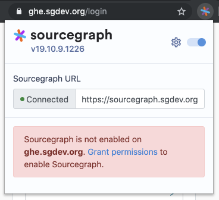

# G Suite and Chrome Enterprise integration

> NOTE: Company-wide deployment via G Suite is a [paid upgrade](https://about.sourcegraph.com/pricing)

You can install and preconfigure the Sourcegraph Chrome extension for all users in your G Suite organization, so that they can get code intelligence on files and diffs.

## Automatically install with G Suite

Using the Google Admin Console, you can [force install](https://support.google.com/chrome/a/answer/6306504?hl=en) the Sourcegraph browser extension for all users in your organization. To do so:

1. Visit the Google Admin Console [Chrome management](https://admin.google.com/u/2/ac/chrome/apps/user) page, and click "Apps and extensions".
2. Select the name of your organization in the left-hand menu.
3. Click the **+** button to add an extension, select "Add Chrome app or extension by ID", and paste in the ID of the Sourcegraph browser extension: `dgjhfomjieaadpoljlnidmbgkdffpack`.
4. In "Installation Policy", select "Force install".
5. In the "Policy for extensions" field, fill in a JSON value containing the URL of your self-hosted Sourcegraph instance:

```
{
    "sourcegraphURL": {
        "Value": "https://sourcegraph.example.com"
    }
}
```
6. Click "Save".

The Sourcegraph browser extension will then be rolled out to all managed browsers in your organization, preconfigured to point to your self-hosted Sourcegraph instance. The roll-out may take some time.

Users will need to be logged in to your self-hosted Sourcegraph instance for the browser extension to provide code intelligence.

Users may also need to grant additional permissions to the Sourcegraph browser extension in order for it to provide code intelligence on your code host. To check if Sourcegraph is properly configured, navigate to any page on your code host, and click the Sourcegraph icon in the browser toolbar. The popup will prompt you to grant additional permissions if needed:




